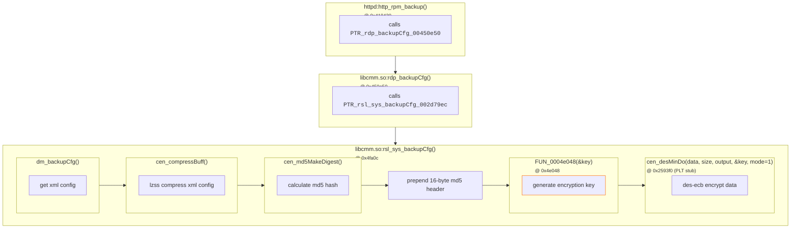
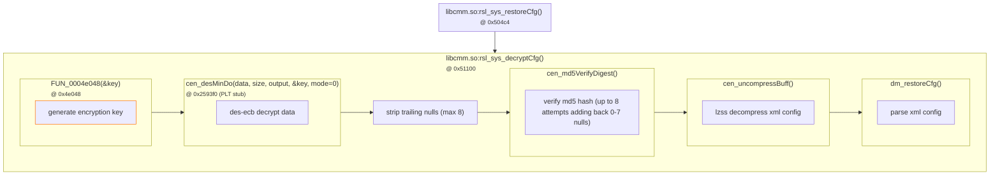
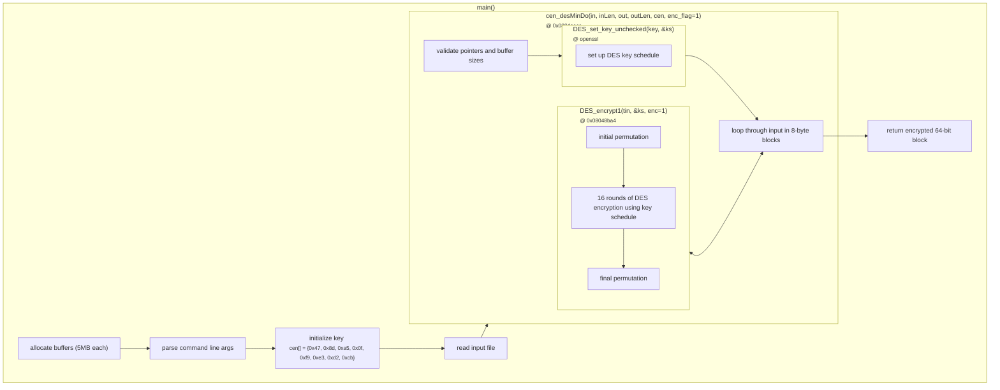
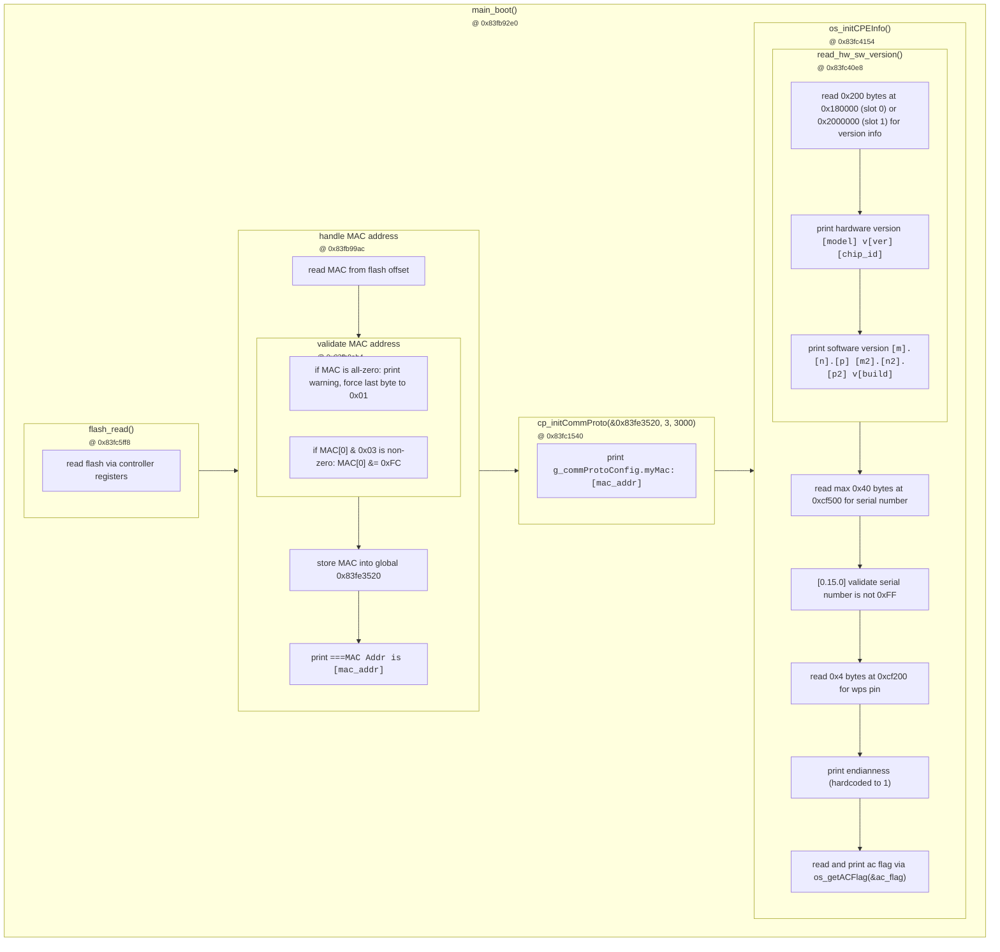
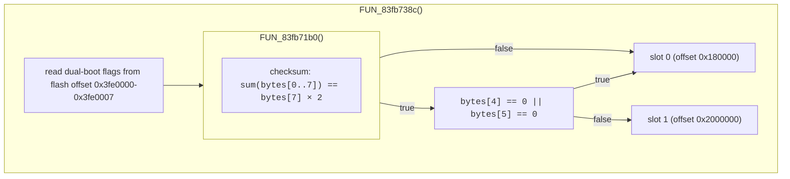

# TP-Link Firmware Tools

This repository contains a suite of tools for working with firmware blobs from modern TP-Link routers and mesh systems.

- [misc_unpack.py](misc_unpack.py): unpacks `misc` partition into device-specific xml configs
- [misc_repack.py](misc_repack.py): repacks `misc` partition from reference partition and xml config
- [fw_patch.py](fw_patch.py): patches `*.bin` firmware image to skip version and md5 checks
- [default_config.py](default_config.py): converts `default_config.xml` and `reduced_data_model.xml`

This project is part of a broader effort to enable OpenWrt support on more devices with supported chipsets. Additionally, the tools allow users to back up, inspect and migrate their network and device configurations without being locked into the proprietary format. If the device was rendered non-functional by a bad OTA update, you can follow these steps to recover the lost configuration and restore it to a working state.

You will need to supply your own model's encryption keys in the `.env` file. You can find these by extracting binaries from officially provided firmware images and disassembling them. This analysis uses the firmware for EX230v as an example, whose keys are available through Internet service providers. The procedures are confirmed working as of February 2026.

- [Firmware Verification](#firmware-verification)
- [Converting Device Configuration](#converting-device-configuration-misc)
- [Converting Backup Configuration](#converting-backup-configuration-_backupcfgbin)
- [Converting Default Configuration](#converting-default-configuration-etcdefault_configxml--etcreduced_data_modelxml)
- [Bootloader](#bootloader-econet)

### Usage
- Clone the repository: `git clone https://github.com/jqssun/tplink-firmware-tools.git`
- (Optional) Edit the `.env` file with your model's keys: `mv .env* .env.$MODEL`
    - It is possible the default keys provided will work for your model as well. All scripts automatically look for the file matching `.env*` in the current directory to load the keys.
- Run program for more instructions: `python3 [misc_unpack.py|misc_repack.py|fw_patch.py|default_config.py]`
- If the program fails, you likely need to supply your own keys - follow the instructions below. If the keys work for a model that is not listed in the repository, please consider submitting a pull request to help the community.

### Requirements
- [Firmware Image](#references): `binwalk -e *.bin` with `unsquashfs` to extract
- [Ghidra](https://github.com/NationalSecurityAgency/ghidra): static analysis on extracted binaries
- [BusyBox](https://git.busybox.net/busybox.git): statically compiled for target arch (e.g. MIPS BE)

## Firmware Verification

To look at the firmware upgrade process, we can trace the methods called from the web interface (**Advanced** > **System Tools** > **Firmware Upgrade** > **Local Upgrade**) by disassembling `libcmm.so`, `libcutil.so`, and `httpd` extracted from firmware image.

### Sequence of Function Calls



```mermaid
graph TD
subgraph http_rpm_update ["httpd:http_rpm_update() <small><br>@ 0x00416c20</small>"]
O1["A: /cgi/softup <br>web interface <b>Local Upgrade</b>"]
O2["B: /cgi/localAgentSoftup <br><b>EasyMesh</b> agent upgrade"]
subgraph cmem_updateFirmwareBufAlloc ["libcutil.so:cmem_updateFirmwareBufAlloc() <small><br>@ 0x000136bc</small>"]
subgraph cmem_getUpdateBufSize ["libcutil.so:cmem_getUpdateBufSize() <small><br>@ 0x00013670</small>"]
B["0x2000104 (33554692 bytes)"]
end
C["allocate size"]
end
D["print <small><br><code>start httpd FW...<br>finish httpd FW...</code></small>"]
subgraph http_rpm_softburn ["httpd:http_rpm_softburn() <small><br>@ 0x004179e0</small>"]
subgraph rdp_updateFirmware ["libcmm.so:rdp_updateFirmware() <small><br>@ 0x0003e6ac</small>"]
subgraph rsl_sys_updateFirmware ["libcmm.so:rsl_sys_updateFirmware() <small><br>@ 0x0005fa00</small>"]
E1["size validation"]
E20["md5 verification"]
subgraph oal_sys_getTagOffset ["libcmm.so:oal_sys_getTagOffset() <small><br>@ 0x00059308</small>"]
E21["0x0000000"]
end
subgraph cen_md5VerifyDigest ["libcutil.so:cen_md5VerifyDigest() <small><br>@ 0x00027210</small>"]
E22["verify md5"]
end
E3["kernel signature check"]
E4["product id check"]
E5["product version check"]
E6["special version check"]
E7["hardware version check"]
E8["flash write"]
end
end
end
end

O1 --> cmem_updateFirmwareBufAlloc
O2 ~~~ cmem_updateFirmwareBufAlloc
cmem_updateFirmwareBufAlloc --> D --> http_rpm_softburn
cmem_getUpdateBufSize --> C
E1 --> E20 --> E21 --> cen_md5VerifyDigest --> E3 --> E4 --> E5 --> E6 --> E7 --> E8
%% {init: {"flowchart": {"defaultRenderer": "elk"}} }%%
linkStyle 0 stroke:#f00,stroke-width:8px
style E22 stroke:#FF6D00
```

### Firmware Verification Flow
Looking at `libcmm.so:rsl_sys_updateFirmware @ 0x0005fa00` (simplified)

```c
// [1] size validation
if (firmware_size < 0x30000 || firmware_size > cmem_getUpdateFirmwareSize()) {
    return 0x1196;
}

// [2] md5 verification
tag_start = firmware_ptr + oal_sys_getTagOffset();  // tag_start = firmware_ptr
stored_md5[0-3] = *(uint32*)(tag_start + 0x40);
FUN_00059308(&constants);
*(uint32*)(tag_start + 0x40) = constants[0];
*(uint32*)(tag_start + 0x44) = constants[1];
*(uint32*)(tag_start + 0x48) = constants[2];
*(uint32*)(tag_start + 0x4c) = constants[3];
if (cen_md5VerifyDigest(&stored_md5, firmware_ptr, firmware_size) == 0) {
    return 0x1197;
}
*(uint32*)(tag_start + 0x40) = stored_md5[0];

// [3] kernel signature check
memcpy(backup, kernel_start + 0xd0, 0x80);
if (signature_check_function(firmware_ptr, firmware_size) == 0) {
    return 0x1197;
}
memcpy(kernel_start + 0xd0, backup, 0x80);

// [4] product id check (skipped if local_183 set)
if (local_183 == 0 && tag_product_id != device_product_id) {
    return 0x1197;
}

// [5] product version check
if (tag_product_ver != device_product_ver) {
    return 0x1197;
}

// [6] special version check (skipped if local_183 set)
if (!special_ver_ok && local_183 == 0) {
    return 0x1197;
}

// [7] hardware version check
if (tag_hw_ver < device_hw_ver) {
    return 0x119a;
}

// [8] flash write
if (oal_sys_writeImage(device, firmware_ptr, firmware_size) == 0) {
    return 0;
}
return 1;
```
[2] For md5 verification, the [original md5 hash portion of the firmware buffer](#firmware-tag-header-structure) is first stored separately, then replaced with hardcoded constants [`fw_md5_constants_*`](.env.ex230vv1#L2-L5) in `libcmm.so:FUN_00059308()`. The function then calls `libcutil.so:cen_md5VerifyDigest(uint8 *expected_md5, uint8 *buffer, uint32 size) @ 0x00027210` to calculate the md5 hash of the updated firmware buffer and compare it against the stored value.

[6] The special version check passes if either of the following is satisfied:
- `(device_ver & 0xffff0000) == 0`: device version is set to 0
- `((device_ver ^ tag_ver) & 0xffff0000) == 0` and `(device_ver & 0xf) <= (tag_ver & 0xf)`: upper 16 bits match, and lower 4 bits satisfy device_ver <= tag_ver

The error codes are defined as follows:

| Code | Description |
|:--:|--|
| `0x0000` | success |
| `0x0001` | generic error (flash write failed) |
| `0x1196` | invalid firmware size |
| `0x1197` | md5/signature/product check failed (overloaded) |
| `0x119a` | hardware version too old |

If flashing via the web interface, there is an RSA signature check for the `kernel` partition. However, downgrades can still be performed if an older version of the firmware is available for patching via [fw_patch.py](fw_patch.py). As a fallback, if you have shell access, you can also flash the firmware by directly writing to the other slot using `busybox dd of=/dev/mtdblock$PARTITION`, then [set the boot flag manually](#dual-boot-implementation).

### Firmware Tag Header Structure

| Offset | Size | Description |
|:--:|:--:|--|
| `0x00` | `0x00004` | magic/header |
| `0x04` | `0x00021` | hardware id |
| `0x24` | `0x00021` | oem id |
| `0x34` | `0x00004` | product id |
| `0x38` | `0x00004` | product version |
| `0x3c` | `0x00004` | additional hardware version |
| `0x40` | `0x00010` | md5 hash |
| `0x8c` | `0x00004` | software version |
| `0x94` | `0x00004` | special version |


## Converting Device Configuration (`misc`)

Live device-specific configuration is stored in the `misc` partition (`/dev/mtdblock3`, size 1MB). You can find it via `ls /dev/$(cat /proc/mtd | grep misc | awk -F: '{print $1}')`. This contains an encrypted xml config which can be analyzed by disassembling `libcmm.so` and `libgdpr.so` extracted from firmware image.

### Partition Structure

To determine partition offset, subtract the offset of the `misc` partition `0x80000` from the flash offset values below.

| Flash Offset | Size | Used By | Description |
|:--:|:--:|:--:|--|
| `0x80000` | `0x20000` | `oal_sys_readCfgFlash` | [main configuration](#configuration-structure) |
| `0xa0000` | `0x20000` | `oal_sys_readBaseCfgFlash` | [base/isp configuration](#configuration-structure) |
| `0xcf100` | `0x00006` | `oal_sys_readMacFlash` | mac address |
| `0xcf110` | `0x00029` | `oal_sys_readOemidFlash` | oem id |
| `0xcf140` | `0x00018` | `oal_sys_readZoneFlash` | zone/region |
| `0xcf160` | `0x00029` | `oal_sys_readHwidFlash` | hardware id |
| `0xcf200` | `0x00004` | `oal_sys_readPinFlash` | wps pin |
| `0xcf300` | `0x00029` | `oal_sys_readDevIdFlash` | device id |
| `0xcf500` | `0x00040` | `oal_sys_readSnFlash` | serial number |
| `0xcf600` | `0x00004` | `oal_sys_readCountryFlash` | country code |
| `0xcf700` | `0x00100` | `oal_sys_readFunctionCodeFlash` | function code |
| `0xcf800` | `0x00001` | `oal_sys_readISPFlagFlash` | isp flag |

### Configuration Structure

For both `main` and `base/isp` configurations, the encrypted xml config is prepended with a header of the following format.

| Offset  | Size | Description |
|:--:|:--:|--|
| `0x00` | `0x00004` | size of plain text xml config (big-endian uint32) |
| `0x04` | `0x00004` | magic: [`0x98765432`](.env.ex230vv1#:L6) |
| `0x08` | `0x00004` | N/A |
| `0x0c` | `0x00004` | type: `2`/`3` (encrypted); `0`/`1` (plain text) |
| `0x10` | N/A | encrypted xml config (padded to 16-byte boundary) |

### Encryption

When the firmware loads each device config, it first checks whether the size of the config is smaller than `0x20000` and errors if not, as handled by `libcmm.so:oal_sys_readCfgFlash() @ 0x001f4c44` and `libcmm.so:oal_sys_readBaseCfgFlash() @ 0x001f39e0`. It then decrypts the config using AES-128-CBC implemented in `libgdpr.so:aes_cbc_decrypt_intface_bypart()` where both the [key](.env.ex230vv1#L7) and [IV](.env.ex230vv1#L8) are hardcoded in `libgdpr.so`.

Upon writing the config, `libcmm.so:oal_sys_writeCfgFlash()` and `libcmm.so:oal_sys_writeBaseCfgFlash()` are called, which in turn call `libgdpr.so:aes_cbc_encrypt_intface_bypart()` after applying PKCS#7 padding to align it to a 16-byte boundary.

The Python script [misc_repack.py](misc_repack.py) modifies up to `0x40000` of the `misc` partition. The rest of the partition is preserved from the reference `misc.bin` (dumped from `/dev/mtdblock3`) to avoid overwriting device-specific data.

## Converting Backup Configuration (`*_backupcfg.bin`)

These are backup files generated from the web interface (**Advanced** > **System Tools** > **Backup & Restore** > **Backup**). Encryption details can be analyzed by disassembling `libcmm.so` and `httpd` extracted from firmware image.

### Sequence of Function Calls

1. When a backup is triggered in the web interface:


2. When a backup config is uploaded in the web interface to be restored:


To retrieve the encryption key, we need to focus on the decompiled code at `FUN_0004e048`.
```c
void FUN_0004e048(uint *param_1) {
    int iVar1;
    byte local_5dc[1172];

// get DevInfo structure (object id 2, size 0x5b0)
    iVar1 = dm_getObj(2, &local_1c, 0x5b0, local_5dc + 0x10);

    if (iVar1 == 0) {
// copy base key to output [1]
        *param_1 = base_key_0;
        param_1[1] = base_key_1;

// read ProductID from DevInfo[0x484] [2]
        snprintf(local_5dc, 0x10, "%08x", local_148);

// XOR base key with the hex string
        for (i = 0; i < 8; i++) {
            *(byte*)((int)param_1 + i) ^= local_5dc[i];
        }
    }
}
```

In other words, the key generation algorithm is:
```c
const char *backupcfg_base_key;
uint64_t base_key = strtoull(backupcfg_base_key, &endptr, 16); // [1]
uint32_t product_id = dm_getObj(2)[0x484];                     // [2]

char hex_str[9]; 
sprintf(hex_str, "%08x", product_id);
uint64_t str_val;
memcpy(&str_val, hex_str, 8);                                  // [3]

// EN7516 is big-endian
#if __BYTE_ORDER__ == __ORDER_LITTLE_ENDIAN__
    str_val = __builtin_bswap64(str_val);
#endif
uint64_t key = base_key ^ str_val;
```

[1] The generic base key [`backupcfg_base_key`](.env.ex230vv1#L9) is hardcoded in `libcmm.so @ 0x24dfd0` with format string `%08x` specified in `libcmm.so @ 0x24dfc8`. This can either be found by following the decompiled code analyzed by Ghidra, or tracing the function that produced the log message "Get dev info for BNR key failed" in `libcmm.so @ 0x25dfa8`.

[2] To find ProductID, we need to look at `libcmm.so @ 0x4e160`.
```asm
lw v0,0x4b8(s8)     ; load ProductID
                    ; DevInfo buffer is at s8+0x34
                    ; offset: 0x4b8 - 0x34 = 0x484
```
This indicates ProductID is stored in memory within the DevInfo structure. To retrieve its value, we need to [perform runtime memory analysis](#runtime-memory-analysis). For this model, [`product_id`](.env.ex230vv1#L11) has been found to be the value of the `X_TP_ProductID` field in the decrypted `/etc/reduced_data_model.xml`. By following the algorithm, this results in the final DES key [`backupcfg_key`](.env.ex230vv1#L10).

[3] The actual key is produced by XOR'ing base key against ASCII ProductID.

### Runtime Memory Analysis
1. Locate the httpd process and its shared memory, and then dump it to a file
```sh
ps | grep httpd
# 1841 admin 16784 S httpd
cat /proc/1841/maps | grep "rw-s"
# 58800000-59000000 rw-s 00000000 00:01 65538  /SYSV000004d2 (deleted)
busybox dd if=/proc/1841/mem bs=4096 skip=$((0x58800000/4096)) count=256 > /tmp/shm_dump.bin
```
2. Analyze the shared memory
- Transfer the dump `/tmp/shm_dump.bin` to a local machine
- Extract ProductID using a quick Python script: DevInfo struct in memory has a header `0x00020000` (object id 2). By locating the first occurrence of `00020000 00000000 00000000` in the dump, we found the start of DevInfo at `shm_dump.bin @ 0x2bc0`.
```python
with open('shm_dump.bin', 'rb') as f:
    data = f.read()
devinfo_start = 0x2bc0 # located by searching for `00020000 00000000 00000000`
product_id_offset = 0x484
absolute_offset = devinfo_start + product_id_offset
product_id = int.from_bytes(data[absolute_offset:absolute_offset+4], 'big')
```

### Verifying Decryption
```python
from Cryptodome.Cipher import DES

base_key = str(backupcfg_base_key)
product_id_hex = int(str(product_id), 16)

key = bytearray(bytes.fromhex(base_key))
for i in range(8):
    key[i] ^= ord(f"{product_id_hex:08x}"[i])
print(key.hex())

cipher = DES.new(bytes(key), DES.MODE_ECB)
with open('backupcfg.bin', 'rb') as f:
    decrypted = cipher.decrypt(f.read())

# format: [16-byte md5 hash][lzss compressed xml][0-7 null padding]
```
Once the key is found, use [tpconf_bin_xml.py](https://github.com/sta-c0000/tpconf_bin_xml) to decrypt `*_backupcfg.bin`. You will first need to specify the key that you found for your model as in [this commit](https://github.com/sta-c0000/tpconf_bin_xml/commit/e8a918778e84689b406b9f911e62c2209cf9e4a2.patch).


## Converting Default Configuration (`/etc/default_config.xml` & `/etc/reduced_data_model.xml`)

When the firmware is built, `/etc/{default_config,reduced_data_model}.xml` are encrypted with `platform/host_tools/enc`. This tool has the following usage:
- encrypt: `enc -e -i <input_file> [-o <output_file>]`
- decrypt: `enc -d -i <input_file> [-o <output_file>]`

By disassembling the Linux x86 ELF binary in the firmware source, you can see it also uses DES encryption with a hardcoded key [`default_config_key`](.env.ex230vv1#L1).

### Sequence of Function Calls


## Bootloader (EcoNet)

On the EcoNet routers, the serial console offers limited capabilities. This section looks at the bootloader file `10200` (build date: 2022-11-25, size: 217,120 bytes) extracted from the firmware image. This file is also available via the GPL source code at `sdk/en7516/bootrom/tcboot.bin`.

The image base is at `0x83fb0000`, derived from the reset vector found at file offset `0x280`:
```assembly
3c 1a 83 fb    lui  $k0, 0x83fb
27 5a 02 90    addiu $k0, $k0, 0x290
03 40 00 08    jr   $k0              ; 0x83fb0290
```

### Sequence of Function Calls (Boot Process)

The following can be renamed to facilitate analysis:
| Functions | Labels |
|:--:|:--:|
| `FUN_83fb92e0` | `main_boot` |
| `FUN_83fc1540` | `cp_initCommProto` |
| `FUN_83fc4154` | `os_initCPEInfo` |
| `FUN_83fc5ff8` | `flash_read` |
| `FUN_83fbcd30` | `flash_read_wrapper` |
| `FUN_83fc40e8` | `read_hw_sw_version` |

| Globals | Labels |
|:--:|:--:|
| `DAT_83fe3520` | `g_mac_address` |
| `DAT_840b43a8` | `g_commProtoConfig.myMac` |
| `_DAT_bfa10044` | `FLASH_DATA_REG` |
| `_DAT_bfa1002c` | `FLASH_STATUS_REG` |

The bootloader reads device information from these flash locations at boot:
| Flash Offset | Size | Description |
|:--:|:--:|---|
| `0xffb6` | `0x00001` | boot config flag |
| `0xcf100` | `0x00006` | mac address |
| `0xcf200` | `0x00004` | wps pin |
| `0xcf500` | `0x00040` | serial number |
| `0x180000` | `0x00200` | version info (slot 0) |
| `0x2000000` | `0x00200` | version info (slot 1) |
| `0x3fe0004` | `0x00001` | dual-boot flag |
| `0x3fe0005` | `0x00001` | dual-boot flag |
| `0x3fe0007` | `0x00001` | dual-boot flags checksum |

### Serial Console
Console access can be activated by pressing any key during the timeout prompt. The timeout depends on the boot config flag `0xffb6` set in flash:
- `0xffb6 & 0x02 != 0`: < 1s
- `0xffb6 & 0x02 == 0`: 
  - `EX230vv1_0.11.0*.bin`: 3s
  - `EX230vv1_0.15.0*.bin`: 5s

### Dual Boot Implementation

To manually set dual-boot flags post-boot:
```sh
busybox hexdump -C -s 0x3fe0000 -n 8 /dev/mtdblock0

# force slot 0
busybox printf '\x00' | busybox dd of=/dev/mtdblock0 bs=1 seek=$((0x3fe0004)) count=1 conv=notrunc

# force slot 1
busybox printf '\x00\x00\x01\x01\x01\x01\x00\x04' | busybox dd of=/dev/mtdblock0 bs=1 seek=$((0x3fe0000)) count=8 conv=notrunc
```


## References
- [EX230vv1_0.11.0_2.0.0_*.bin](http://download.tplinkcloud.com/firmware/EX230vv1_0.11.0_2.0.0_UP_BOOT_agc3000(221125)_2022-11-25_16.58.17_1689837882305.bin)
- [EX230vv1_0.15.0_2.0.0_*.bin](http://download.tplinkcloud.com/firmware/EX230vv1_0.15.0_2.0.0_UP_BOOT_agc3000(240802)_2024-08-02_17.33.33_1740539445857.bin)
- [EX230v_EU1_GPL.tar.gz](https://static.tp-link.com/upload/gpl-code/2024/202411/20241104/EX230v_EU1_GPL.tar.gz)
